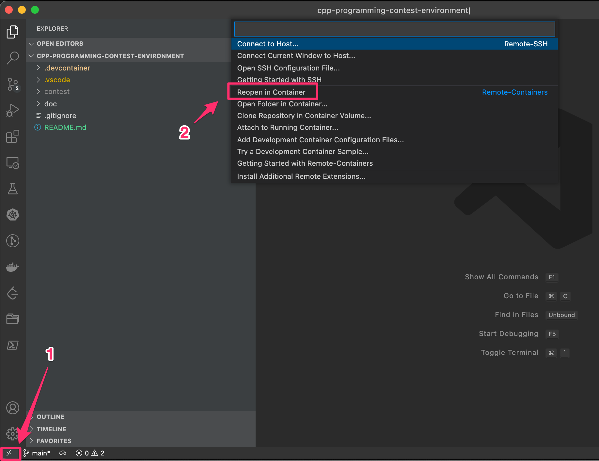
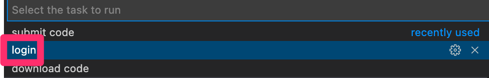
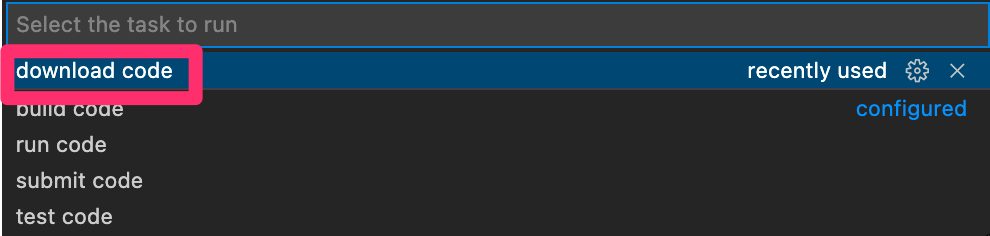
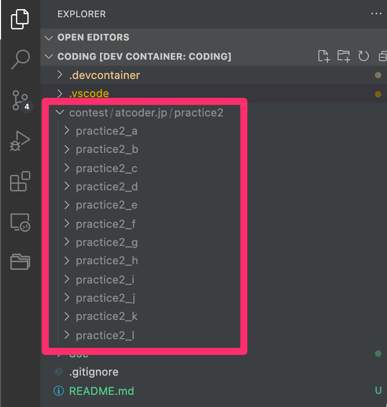

# 2-Click C++ Programming Contest Environment

This repository make it possible for programmers to create C++ programming contest environment by 2-Click.

## Why is it useful?

It is very tedious job to install all necessary compilers and tools to local computer. There might be some errors to overcome to submit C++ program to programming contest service. What programmers want to do is not developping environment but developping program.

This repository uses [VSCode Dev Container](https://code.visualstudio.com/docs/remote/containers) to create the environment with 2-Click.

## Tested Environments

* Windows 10
* Mac with Intel Chip
* Mac with Apple Chip

## Getting started

### Requirements

Install the following applications.

* [Docker Desktop](https://www.docker.com/products/docker-desktop)
* [VSCode](https://code.visualstudio.com/)

### Setup environment

Open this repository with VSCode. 
Click left bottom corner of the VSCode window as follows, then choose "Reopen in Container".

Wait for a while. After builds and setups, you can write code in dev container environment.
(First time, it takes for long time, but next time, it's quick to open the environment.)

This environment contains the following tools.

* [online-judge-tools](https://github.com/online-judge-tools/oj)
* [online-judge-template-generator](https://github.com/online-judge-tools/template-generator)
* [atcoder-cli](https://github.com/Tatamo/atcoder-cli)

### Solve programming content problem

For example, let's solve [AtCoder Library Practice Contest
](https://atcoder.jp/contests/practice2).

There are three tasks to do.

1. Login (Once)
2. Download problem
3. Solve and submit

First, login to the contest page to submit code afterwards.

To login/download/submit problem, the dev container uses `oj` tool.
In this repository, there is the specific VSCode task to login contest site.

Choose `Terminal -> Run Task` from VSCode menu, then choose `login`.
You should enter, `https://atcoder.jp/contests/practice2` as url,  `your atcoder username` as password and `your atcoder password` as password. If you haven't created account, please create it for [register](https://atcoder.jp/register).

Second, choose `Terminal -> Run Task` from VSCode menu, then choose `download code`.

Enter the problem URL `https://atcoder.jp/contests/practice2` to the input and click enter.
Inside the task, `oj-prepare https://atcoder.jp/contests/practice2` is executed, automatically problem set is donwloaded to under `contest/atcoder.jp/practice2` directory.

Open, `contest/atcoder.jp/practice2/practice2_a/main.cpp` in VSCode, then solve the problem.

Lastly, you can submit the code to AtCoder.
Choose `Terminal -> Run Task` from VSCode menu while opening the solved `main.cpp` code, then choose `submit code`.

Boom! The code is tested and submitted to the contest. If it has any error, you can see it on Terminal.

## Tips

### Use debugger

To debug code, click `Run start Debugging` in menu while opening code.
Then, input should be put in terminal. The following shows how to debug the code.

https://user-images.githubusercontent.com/5561944/158003876-9c6bf878-61c0-45de-9993-80b875f7fc8b.mp4

### Use git to commit problem codes.

Any file under `content` directory, it is ignored by `.gitignore`. 
You can delete `contest` line from `.gitignore` to commit these files.

